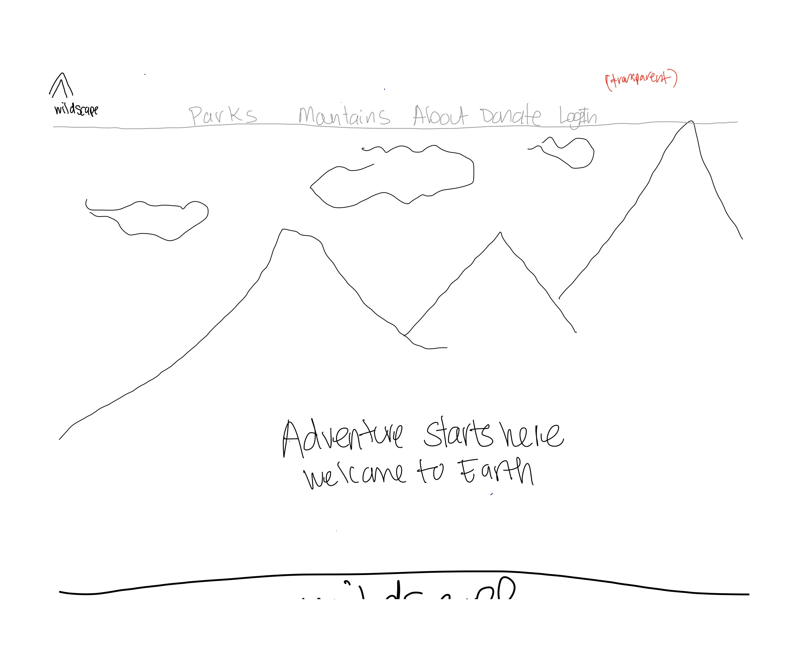
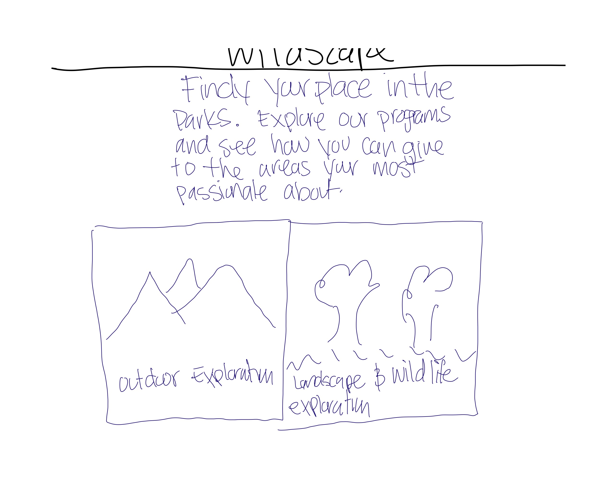
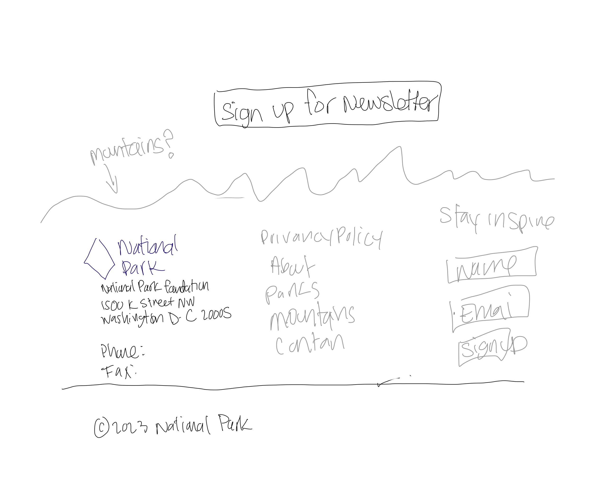
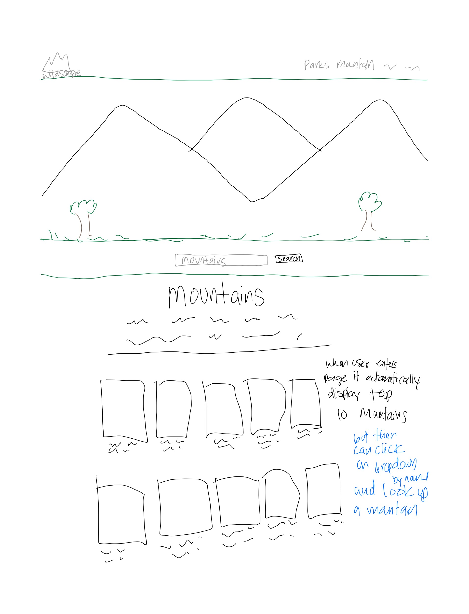
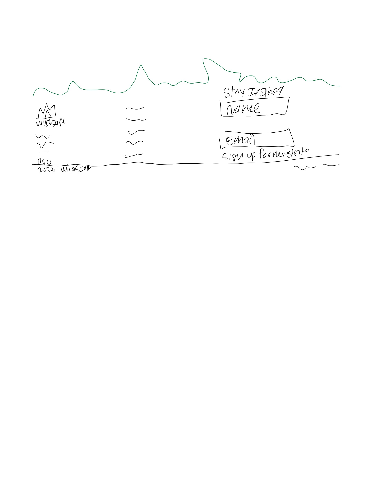
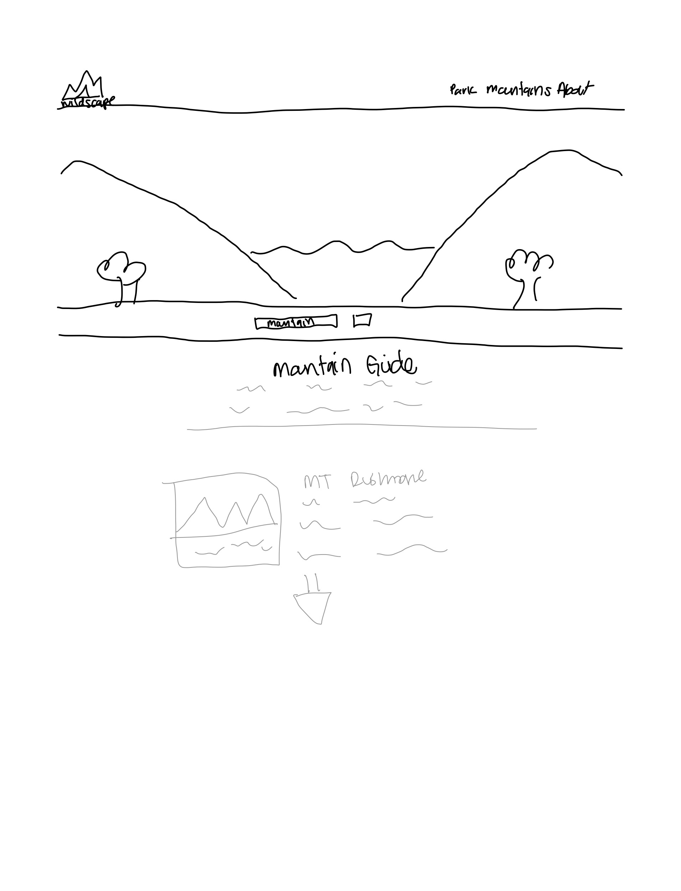

# Wildscape

## Overview
Wildscape is an interactive web platform dedicated to exploring the natural beauty of US national parks and mountains. Our site offers a comprehensive guide for outdoor enthusiasts to browse, discover, and plan visits to various national parks and hiking trails across the United States.

## Features

### National Parks
- **Explore Parks**: Users can explore a vast array of national parks. Each park is detailed with beautiful imagery, park history, visitor information, and tips for making the most of your visit.
- **Search Functionality**: Easily search for parks based on states, activities, or park names.

### Mountains to Hike
- **Mountain Guides**: Detailed guides for a range of mountains suitable for various skill levels. From gentle hikes to challenging climbs, there's something for every adventurer.
- **Interactive Maps**: Interactive maps to help users visualize the location and trails of the mountains.

### User Interaction
- **Plan Your Visit**: Tools and features to help users plan their visits, including difficulty level, sunset/sunrise.

## Images

